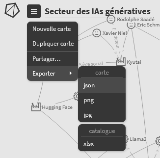

# StemicToGephi
A short script to convert a graph created on [Stemic](https://stemic.app/ "https://stemic.app/") (an interactive and online service to create and show graphs) as two csv files (edges and nodes) which can be easely imported in [Gephi](https://gephi.org/ "https://gephi.org/") (an open-source software to create, complete and analyze graphs) or used as benchmark by example.
This project is stopped today but could be improved in the future.

## Creation
25/01/2024

## Last modification of the code
13/02/2024

## Authors
- Simon Biffe  

## Usage

Firstly, you have to download the json file matching whith your Stemic map, as showed here:

Then, you have two possibilities:
- Execute the script StemicToGephi.py in the depository where you want written the csv files returning
- Call the stemic_to_data function, eventually with your own arguments:
    - file : str  
        Path of the Stemic json file to convert.
    - destination : str, optional  
        Path of the directory where the csv files created will be written.  
        The default is os.getcwd(), the working directory.
    - color_themes : dict, optional  
        Allows to convert Stemic colors in thematics in the csv files.  
        The default is {}.
    - group_label : str, optional  
        Allows to personnalise the label of the links between the subgroups' nodes and their internal nodes.  
        The default is "included_in".

An example of a Stemic json file and the csv files associated is enable in the examples directory.